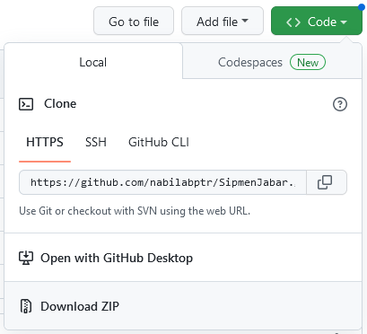

# Sipmen Jawa Barat

**Pastikan sudah install [Node JS](https://nodejs.org/en/download/) di Laptop anda**

1. Klik Download ZIP 


2. Edit file `.env`.
  - SIPMEN_USERNAME = isikan email
  - SIPMEN_PASSWORD = isikan password
3. Edit csv yang ada di folder [data](https://github.com/nabilabptr/SipmenJabar/tree/main/data), tinggal isi tanpa ubah nama kolom. Format tanggal harus `dd/mm/yyyy`. Pastikan nama petugas entri sesuai dengan database sipmen, kalo engga ya error.
4. jalankan scriptnya
	
```
npm install
```
	
   1. Input data pengambilan dokumen.

```
node index.js pengambilan
```

   3. Input data pengembalian dokumen.

```
node index.js pengembalian
```

   4. Hapus record distribusi. 

```
node index.js pengembalian
```

   Jika ingin hapus semua record dalam 1 batch, cukup input id batchnya aja, kalo cuma mau hapus 1 sls, input id SLSnya aja.

**SEMANGAT SIPMEN**

